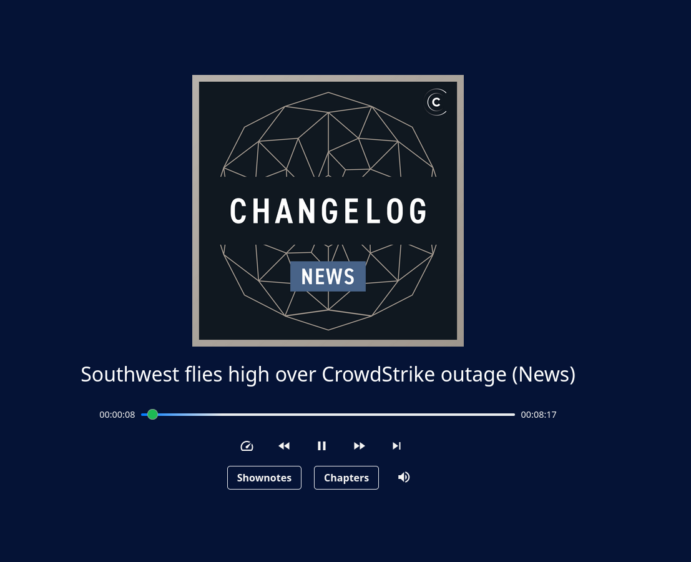
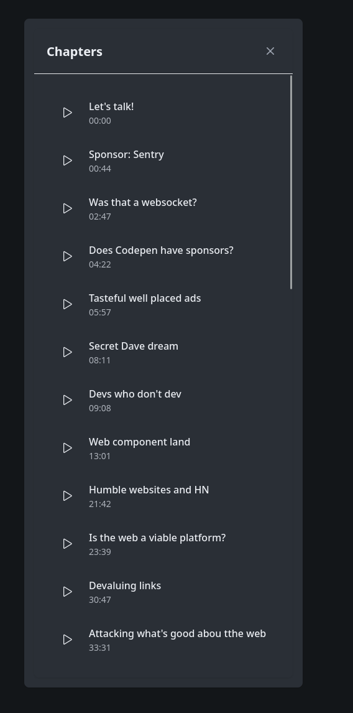

# Chapters

Pinepods supports Chapters as defined by the PodcastIndex Namespace. You won't need to do anything special to take advantage of this really helpful feature. Any podcast episode that you play through podcast will automatically pick up the chapters in the player as seen below:

Clicking the button will show you all the episode chapters. You can click them to skip ahead to a chapter in the episode from there

