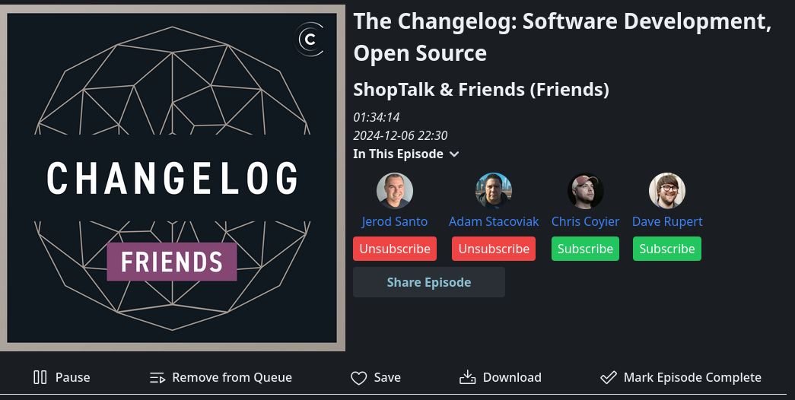

# People

Pinepods supports the Person tag as defined by the PodcastIndex Namespace. Any podcast that includes this tag will show hosts on the main podcast page in a dropdown:

In addition, you'll find individual episodes show guests as part of the people shown on the episode view:

