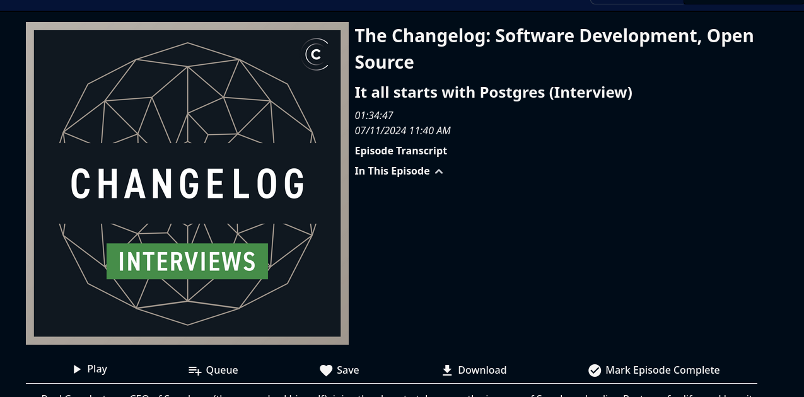

# Transcripts

Pinepods supports Transcripts as defined by the PodcastIndex Namespace. Any podcast episode that you play that supports this field will automatically show links to the episode transcript in the episode view as seen below:

