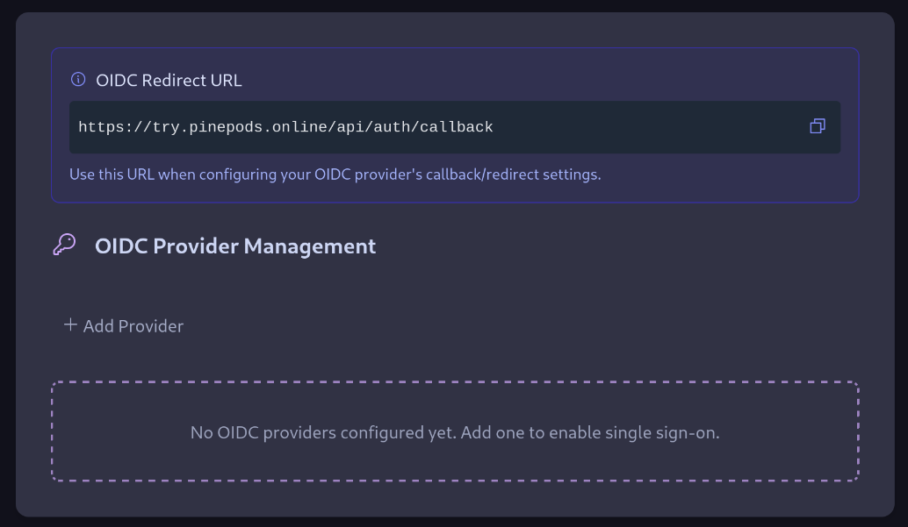
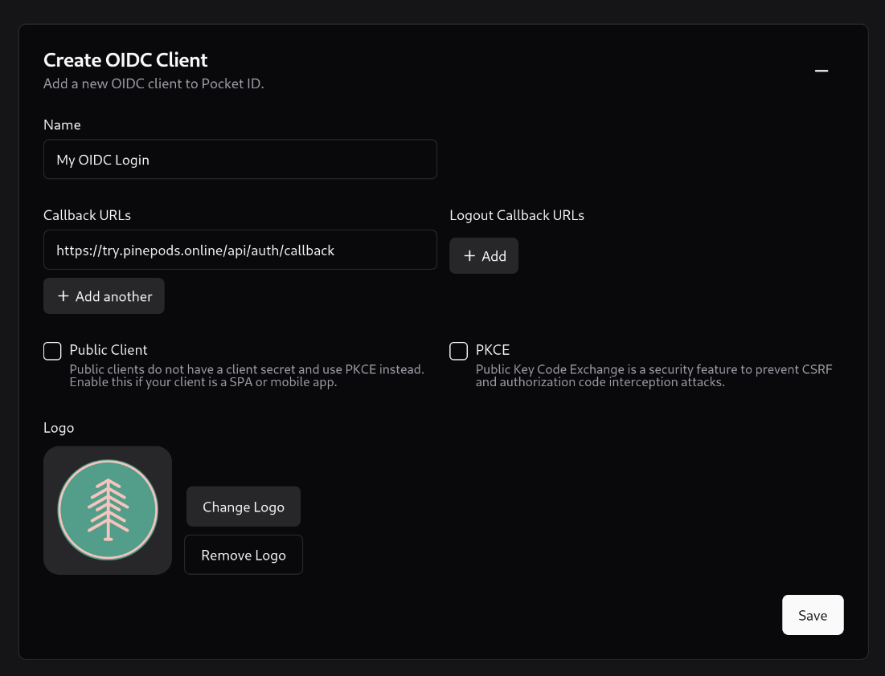
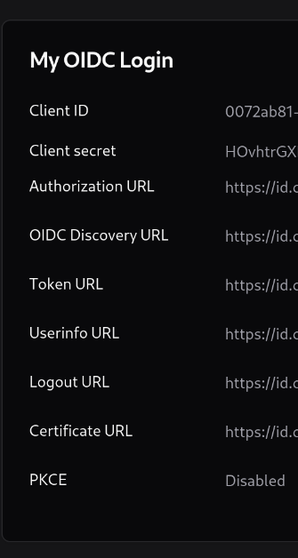
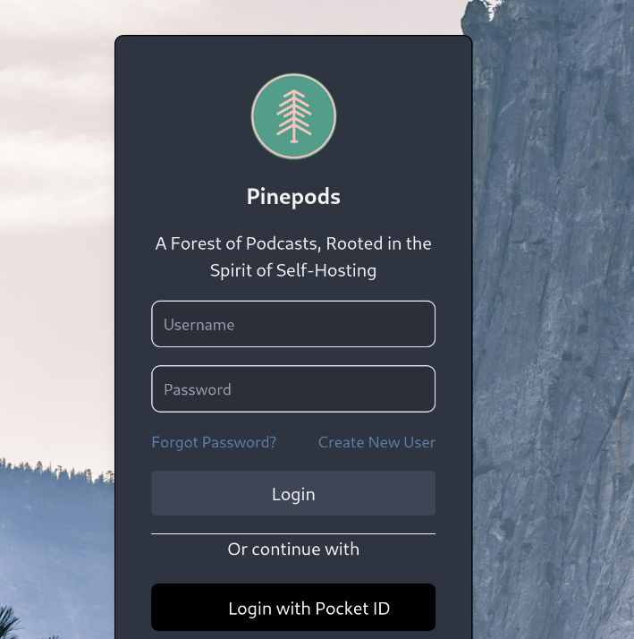

## OIDC Setup

You can now setup OIDC logins in Pinepods to use either your own self-hosted OIDC provider or one of the other large cloud hosted providers such as Github, Google, or Azure. Anything that follows the OIDC standard (and also Github even though they don't follow the standard) will work just fine. Below is instructions for setting up different types of providers 

(NOTE: Only admins can setup OIDC Settings)

### Resources

Before we get started your OIDC provider may provider the option to upload an image of Pinepods to use as the App Image. You should be able to use the one below:


### Using a self-hosted provider (Highly Recommended)

Seriously, since you're already self-hosted Pinepods you might as well self-host an OIDC provider. I recommend [PocketID](https://github.com/pocket-id/pocket-id)

1. First head over to the settings page of Pinepods and open up the OIDC settings area



2. Now click Add Provider - On this page you'll need to fill out the options according to your provider. 

3. Create a new OIDC client in your provider. Enter the callback URL that you can copy from Pinepods into the OIDC provider where it's required. Should be something like this. Do not check public client or PKCE. 



4. Now your provider should give you all the options that Pinepods needs to be setup



5. Go ahead and copy over everything from your provider into the correct fields in Pinepods (You probably won't use every option your provider gave you. That's fine, Pinepods only needs the auth token, and user info url. Along with the ID and secret)

6. At this point you should be left with the Name field, the scopes, button text, text color, button color, and svg options. Put in your provider for the name. If you use PocketID then enter PocketID

7. For the scopes, it'll be somewhat dependant on the provider. Some providers allow you to choose scopes. Pinepods by default will have openid, email, and profile enabled by default. If you use PocketID or a similar self-hosted provider this default will probably work. If you do need to change the scopes, select the dropdown and click the ones you need. 

8. For the button options that's all up to you. The button text field is what the button will say to login. So maybe something like - 'Login with PocketID'

9. For the colors just choose options that are likely to look good together. You might consider using colors that match the colors of your OIDC provider. Just don't choose black text with black button or you won't be able to read it.

10. For the SVG, it's entirely optional and you can click Submit at this point, but if you can either find an SVG for your given provider or use one of the many online converters to convert the favicon of your provider into an svg you can enter it below. This may take some trial and error to get it to show up right. Additionally, you must provide the full svg wrapped in proper svg tag. For example <svg>mysvgcontent</svg>

11. Hit submit! Now go ahead and log out. From here you might need to refresh but you should now see the OIDC login button appear on the page for you. Go ahead and click it. It will route you outside Pinepods and then back in once you've authenticated where you'll setup your account. 




### Using Github As your OIDC Provider

1. First Follow all the steps above until you get to the OIDC provider Settings page and setup some of the initial name information. 

2. Login to Github and go to the settings under your profile. You can also just [Click here and skip to step 4](https://github.com/settings/profile)

3. Then scroll to the bottom and click Developer settings. From here select 'OAuth Apps' Create a new OAuth App. 

4. Create a New OAuth App. Give it a name and enter your Pinepods homepage for the homepage url, enter a description, then copy the callback url from the OIDC settings area in Pinepods and paste it into the Authorization Callback URL text box in github. 

So to clarify, if your Pinepods instance lives at https://try.pinepods.online. You would enter

Application name: Pinepods
Homepage URL: https://try.pinepods.online
Application description: My Pinepods instance rocks!
Authorization callback URL: https://try.pinepods.online/api/auth/callback
Device Flow: false (Leave unchecked)

5. Once created copy the client id and enter it into Pinepods. Then create a secret and paste that into Pinepods as well

6. Feel free to grab the favicon from above to enter an image into Github

7. From here just enter these urls into the auth url, token url, and user info url boxes:
```
Authorization URL:
https://github.com/login/oauth/authorize
Token URL:
https://github.com/login/oauth/access_token
User Info URL:
https://api.github.com/user
```

8. You'll notice the scope auto detected Github. So leave those as is

9. Simply enter the rest based on what's written above about the customization. For svg take a look at the github icons they offer. Otherwise, the one below works pretty great! Just paste that in!

```
<svg xmlns="http://www.w3.org/2000/svg" width="24" height="24" viewBox="0 0 24 24" fill="none" stroke="currentColor" stroke-width="2" stroke-linecap="round" stroke-linejoin="round">
  <path d="M9 19c-4.3 1.4 -4.3 -2.5 -6 -3m12 5v-3.5c0 -1 .1 -1.4 -.5 -2c2.8 -.3 5.5 -1.4 5.5 -6a4.6 4.6 0 0 0 -1.3 -3.2a4.2 4.2 0 0 0 -.1 -3.2s-1.1 -.3 -3.5 1.3a12.3 12.3 0 0 0 -6.2 0c-2.4 -1.6 -3.5 -1.3 -3.5 -1.3a4.2 4.2 0 0 0 -.1 3.2a4.6 4.6 0 0 0 -1.3 3.2c0 4.6 2.7 5.7 5.5 6c-.6 .6 -.6 1.2 -.5 2v3.5"/>
</svg>
```

10. Logout and then authenticate with Github. You'll be asked to authorize the app the first time and then you'll be logged in assuming everything went right!

### Using Google As your OIDC Provider

1. First Follow all the steps above until you get to the OIDC provider Settings page and setup some of the initial name information. 

2. Using a chromium based browser (GCP makes firefox explode) Head over to [The Google Cloud Console](https://console.cloud.google.com/)

3. Either Select an existing Project if you have one or make a new one

4. Click the hamburger menu and then click "APIs and Services". From here, select 'Credentials' on the left

5. Now at the top click 'Create Credentials' and then choose OAuth client ID

6. For app type, choose Web Application, and then provide a name.

7. Click add provider in the OIDC settings in Pinepods and then copy the OIDC redirect URL from Pinepods and paste it into the Authorized redirect URIs in Gsuite. Then click Create.

8. You'll be provided an ID and secret right away. Paste those into Pinepods

9. Now enter the urls for google:

```
Authorization URL: https://accounts.google.com/o/oauth2/v2/auth
Token URL: https://oauth2.googleapis.com/token
User Info URL: https://openidconnect.googleapis.com/v1/userinfo
```

9. Simply enter the rest based on what's written above about the customization. For svg there's plenty of options that can be sourced online. Otherwise, the one below is a basic black Google icon. Feel free to use this.

```
<svg xmlns="http://www.w3.org/2000/svg" width="24" height="24" viewBox="0 0 24 24" fill="currentColor">
  <path d="M12 2a9.96 9.96 0 0 1 6.29 2.226a1 1 0 0 1 .04 1.52l-1.51 1.362a1 1 0 0 1 -1.265 .06a6 6 0 1 0 2.103 6.836l.001 -.004h-3.66a1 1 0 0 1 -.992 -.883l-.007 -.117v-2a1 1 0 0 1 1 -1h6.945a1 1 0 0 1 .994 .89c.04 .367 .061 .737 .061 1.11c0 5.523 -4.477 10 -10 10s-10 -4.477 -10 -10s4.477 -10 10 -10z"/>
</svg>
```

10. Logout and then authenticate with Google. You'll be asked to authorize the app the first time and then you'll be logged in assuming everything went right!