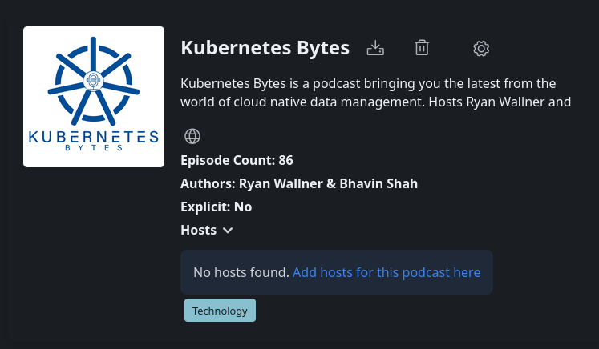

## PodPeopleDB Integration

Pinepods integrates with the PodPeopleDB in order to expand host tracking between podcasts. This is a community project that listeners of the given podcasts submit host information to. It's intended as a suppliment for Podcasts that don't currently support the Person Podcasting 2.0 tag. Entering host information for a given podcast will allow others to see these hosts as well. Because of this, maintaining integrety for hosts is vital. There's a simple approval process for submitted hosts to ensure submitteed hosts are actually corrrect and to prevent abuse.

### Automatic Import via podcast:person Tags

PodPeopleDB automatically imports host and guest information from podcast feeds that use the podcast:person namespace. If your podcast uses these tags, your host information will be automatically imported when someone looks up your podcast. You won't be allowed to submit hosts for podcasts that support this.

<podcast:person role="host" img="http://example.com/host.jpg">Jane Smith</podcast:person>

### Manual Submission

If you open up a podcast without hosts associated with it yet you'll see a link to submit hosts to the PodPeople page for that specific podcast. 

Clicking that link will present you with a page to for the podcast where you can enter host information.

    Fill in the host details:
        Name (required)
        Role (Host or Guest)
        Description
        Link to more information
        Profile image URL
    Submit for approval

Please enter all the information if you can. The image url is optional, but should be entered if possible. 

Approval Process

To maintain data quality, all manual submissions are reviewed before being added to the database. This typically takes an hour or two at most. If you'd prefer to add your own hosts without approval you can always self-host PodPeopleDB if you'd prefer.