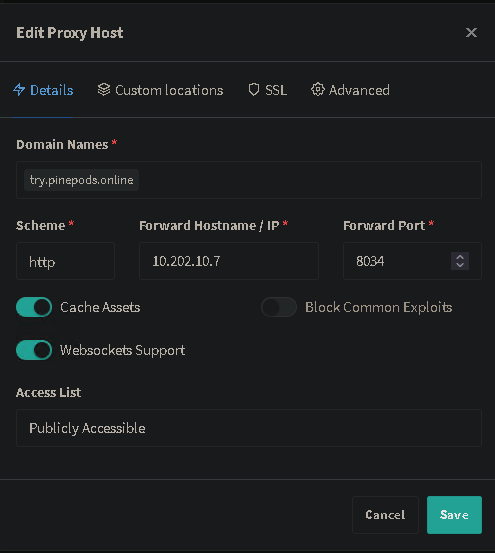

# Reverse Proxy Configuration

## Nginx

### Pinepods 
Coming Soon

### Pinepods Search API
Coming Soon

## Nginx Proxy Manager

### Pinepods 
- Setting up Pinepods on NPM Is hoenstly a snap. Super quick and easy. First of all, decide on a domain name of your choosing. Perhaps something along the lines of pods.*yourdomain.com*? Regardless, once you've decided on that, create a new proxy host in NPM. Whatever you set the web portal port in the compose file should be your main forward port. Default is 8040. So you want something like this:



As you can see, Pinepods uses assets and Websockets. So be sure to also enable that. 

That's it!

### Pinepods Search API
The search API reverse proxy setup is even easier. Do the exact same thing after starting up the backend container by setting up a new proxy host and choose a domain for your pinepods backend service. Set it to point to the external container of your choosing and enable 'cache assets'. Websocket support can be left disabled. 

## Traefik

### Pinepods 
For Pinepods to function behind a reverse proxy you just need to provide the main service a subdomain.
  1. Pinepods Webui - `https://pinepods.server.tld`

The below labels will run the above format in Traefik with an entry point of `websecure`

```yaml
        labels:
            # Pinepods Webui
            - "traefik.http.routers.pinepods.entrypoints=websecure"
            - "traefik.http.routers.pinepods.service=pinepods"
            - "traefik.http.routers.pinepods.rule=Host(`pinepods.server.tld`)"
            - "traefik.http.services.pinepods.loadbalancer.server.port=8040"
```

### Pinepods Search API
There's no absolute need to put the [Search API container](https://www.pinepods.online/docs/API/search_api) behind a reverse proxy unless you intend to use the Pinepods client externally, as it can be run locally for access only to your own Pinepods instance, however if you wish to make the API availeble on WAN then the below labels will run an instance on `https://pinepods-seach-api.server.tld`
```yaml
        labels:
            # Pinepods Search API
            - "traefik.http.routers.pinepods-search-api.entrypoints=websecure"
            - "traefik.http.routers.pinepods-search-api.service=pinepods-search-api"
            - "traefik.http.routers.pinepods-search-api.rule=Host(`pinepods-search-api.server.tld`)"
            - "traefik.http.services.pinepods-search-api.loadbalancer.server.port=5000"
```

Within your Pinepods docker compose file the variable `API_URL` should then be set as 
```
API_URL=https://pinepods-search-api.server.tld/api/search`
```

## Caddy

### Pinepods 
Coming Soon

:::caution

This caddy config has not yet been fully tested. If you try it and it works, please, [open a PR](https://github.com/madeofpendletonwool/Pinepods-Docs/pulls)!

:::
```

pinepods.home.arpa:80 {
	reverse_proxy pinepods:8040
	log {
		output file /var/caddy/log/pinepods/web {
			roll_keep 2
			roll_size 10mb
			roll_keep_for 48h
		}
	}
}
```

### Pinepods Search API

```
search.pinepods.home.arpa:80 {
	reverse_proxy pinepods:5000
	log {
		output file /var/caddy/log/pinepods/search {
			roll_keep 2
			roll_size 10mb
			roll_keep_for 48h
		}
	}
}
```